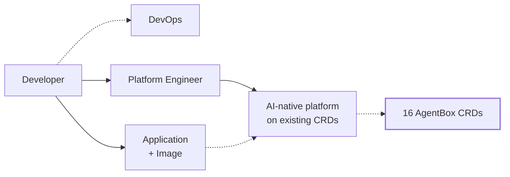
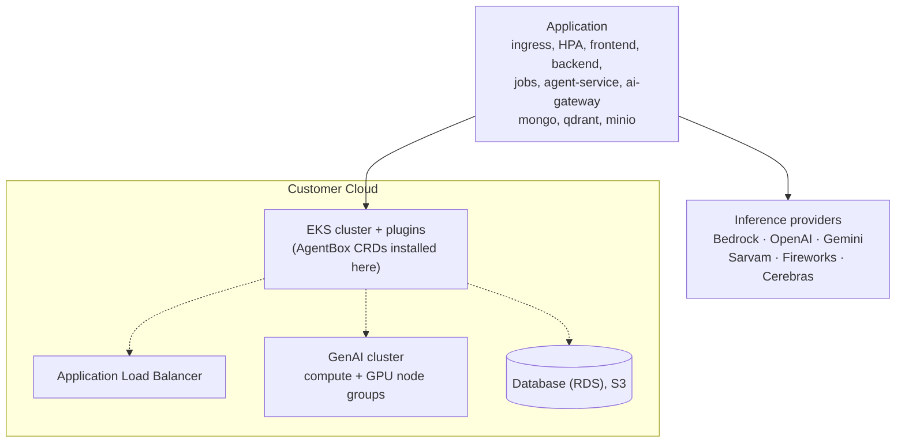

# AgentBox

**Kubernetes primitives for running a company-wide AI stack.**

Sixteen CRDs that give a platform engineer the same grip on models, agents, tools and
spend that they already have on Deployments, Services and Postgres.

```bash
kubectl apply -k crds/
kubectl get harnessruntimes -A
```

```
NAME              KIND     IMAGE                        REPLICAS   READY   STATE    AGE
support-agent     server   acme/support-agent:1.4.0     6          6       active   9d
kyc-reviewer      server   acme/kyc-reviewer:2.0.1      3          3       active   4d
nightly-recon     cron     acme/recon:0.9.0             -          -       active   21d
```

---

## Why I built this

I spend my time putting AI agents inside other people's clouds — regulated companies where
the data cannot leave, so the whole stack lands in their VPC and their platform team
inherits it.

The first few rollouts taught me something uncomfortable. Every one of them was a
snowflake. A gateway wired up by hand here. A vector database someone installed with Helm
and never upgraded there. GPU node groups sized by whoever was on the call that week.
Evaluations living in a notebook on a laptop. And each time, three months later, the
platform team would ask me questions I could not answer from the cluster:

- What agents are running right now, and on whose behalf?
- Which model is that one calling, through which provider, and what did it cost last month?
- Who approved that tool having write access to production?
- If I need to move all of this to a different region tomorrow, what exactly do I move?

These are not exotic questions. The same team could answer every one of them about their
databases without leaving their chair. They run Postgres for two hundred services and it
is *boring* — one team owns it, it has schemas, quotas, backups, dashboards, a self-serve
path for developers, and an obvious blast radius when something breaks.

That contrast is the whole thesis. **The reason apps became boring to run is that
Kubernetes gave platform engineers a vocabulary** — Deployment, Service, Ingress,
HorizontalPodAutoscaler, PersistentVolumeClaim. Once the nouns existed, the tooling,
the review process, the on-call runbook and the org chart all followed.

AI has no such vocabulary. So every company invents one, badly, in YAML and glue code,
and then discovers it cannot be reviewed, audited, budgeted or handed over.

I want AI agents to be adopted the way companies adopt SaaS: a platform engineer decides
it is available, sets the guardrails and the budget, and developers self-serve from there.
That needs primitives first. This repository is my attempt at them.

## What this is

The missing nouns, as Kubernetes CRDs. Nothing more.

**The developer keeps their code.** Your agent is your image — your framework, your
prompts, your graph, your language. AgentBox never asks you to express agent logic in
YAML, because that is exactly the mistake that makes platforms brittle. A
`HarnessRuntime` says *run this image, with this compute, on these ports*. What the agent
does inside is none of the platform's business.

**The platform engineer gets the controls.** Models, gateways, identity, guardrails,
metering, autoscaling, datasets, evaluations — declared as objects, reviewed in pull
requests, applied with `kubectl`, visible with `kubectl get`.

**Existing CRDs stay in charge of what they already own.** No node pool CRD, because
Karpenter and the cluster autoscaler exist. No alert routing CRD, because Alertmanager
exists. No generic workload CRD, because Deployment exists. AgentBox defines only what is
genuinely AI-native, and delegates the rest.

## The operating model



A developer ships an image and asks the platform team for what it needs. The platform
engineer declares that as AgentBox objects. The application's image is what actually runs
inside the harness. Everything underneath is ordinary Kubernetes, so the DevOps path a
company already has — GitOps, policy, RBAC, cost reporting — applies without modification.

## Where it runs

This is the shape of a real deployment: the customer's cloud, their EKS cluster, their
data, their choice of inference.



Self-hosted models run on the GPU node groups and are declared as `Model` plus
`ModelAutoScaler`. Hosted providers are declared as `Gateway`. The agent code does not
change when you move between them — that is the point of having a gateway object at all.

## The CRDs

Full reference with every field: **[docs/crd-reference.md](docs/crd-reference.md)**.

### Serving plane

| Kind | What it is |
|---|---|
| `Model` | A model the platform can serve or call: weights source, architecture, capabilities |
| `ModelAutoScaler` | Scales a Model on queue depth, throughput or GPU utilisation |
| `HarnessRuntime` | Runs a developer's agent image as a workload |
| `HarnessSwarmAutoScaler` | Scales a swarm of harnesses on session and queue pressure |
| `AgentIdP` | Issues workload identity to agents; groups the policies that apply |
| `ToolServer` | Runs an image serving tools over HTTP/gRPC, publishes their contracts |
| `ToolServerAutoScaler` | Scales a ToolServer on call rate, concurrency and latency |
| `Gateway` | Routes model traffic to a provider, with rate limits and parameters |
| `AIMetric` | A metric derived from traces, other metrics, or a model judgement |
| `AIMeter` | Turns metrics into attributed, priced, budgeted usage |

### Training plane

| Kind | What it is |
|---|---|
| `TrainLoop` | A training or evaluation job, once or on a schedule |
| `Dataset` | A connector-backed source or sink, with cursor state and checkpointing |
| `Evaluator` | An evaluation suite: cases plus how to score them |
| `Guardrail` | A metric-driven condition and the effect enforced when it trips |
| `Tracer` | Where traces and logs are exported, in OpenTelemetry shape |
| `Recipe` | A composable multi-stage pipeline definition |

Three of these carry Kubernetes workloads — `HarnessRuntime`, `ToolServer`, `TrainLoop`.
The other thirteen are configuration.

## Quickstart

```bash
pip install -r requirements.txt
kubectl apply -k crds/     # the 16 CRDs
kubectl apply -k deploy/   # the controller that reconciles them
```

Declare a gateway to a provider, then run an agent image against it:

```yaml
apiVersion: ai.agentbox.io/v1beta1
kind: Gateway
metadata:
  name: openai-compatible
spec:
  modelName: llama-3-70b-instruct
  litellmParams:
    model: openai/llama-3-70b-instruct
    apiBase: http://vllm.models.svc:8000/v1
    rpm: 10000
    tpm: 1000000
  modelInfo:
    id: llama-3-70b-instruct
    mode: chat
---
apiVersion: ai.agentbox.io/v1beta1
kind: HarnessRuntime
metadata:
  name: support-agent
spec:
  runtimeKind: server
  code:
    image: acme/support-agent:1.4.0
  replicas: 2
  compute:
    cpu:
      cores: 4
      memoryMb: 8192
  endpoints:
    - name: api
      port: 8080
      path: /api
  health:
    type: http
    path: /healthz
    port: 8080
```

```bash
kubectl apply -f agent.yaml
kubectl get harnessruntime support-agent
kubectl scale harnessruntime/support-agent --replicas=5
```

`HarnessRuntime`, `ToolServer` and `Model` expose the scale subresource, so `kubectl scale`,
HPA-style tooling and GitOps diffs all behave the way your team already expects.

The controller turns each object into what it owns: a `HarnessRuntime` into a Deployment and
Service, a `ToolServer` into those plus a tool catalog its callers can read, an `AgentIdP`
into a ServiceAccount with a Role, a `Gateway` into routing config, an `AIMeter` into a
priced usage figure. Watch it work with `kubectl get harnessruntimes -w`.

More: **[docs/quickstart.md](docs/quickstart.md)**.

## Status

Honest state of the world, so nobody is surprised:

| | |
|---|---|
| ✅ | **16 CRDs**, installable, structural schemas, status + scale subresources, printer columns, 38 CEL validation rules |
| ✅ | **A controller that reconciles all 16 kinds** — watches, builds what each one owns, writes status and conditions, emits events |
| ✅ | **Autoscaling that works**, on the HorizontalPodAutoscaler formula with a tolerance band, stabilization windows and scale-to-zero |
| ✅ | **Metering that computes** — flat, per-unit and tiered pricing, budget thresholds, breach events |
| ✅ | **Python CRUD layer** for every kind, for clusters where you cannot install CRDs |
| ✅ | **Verified end to end** against a live API server — 122 assertions ([`tests/e2e_test.py`](tests/e2e_test.py)) |
| 🚧 | **No admission webhook.** Validation happens at the API server via the CRD schemas and CEL rules, not through defaulting/mutating webhooks |
| 🚧 | **Guardrail effects are reported, not enforced.** The controller decides whether a guardrail trips and says so in status and events; the gateway or harness still has to act on it |
| 🚧 | **The controller is single-replica.** No leader election yet, so do not run two |

`v1beta1` is where the field names settle. I will not rename fields under you from here
without a version bump.

## Design decisions worth knowing

**The CRDs do not reference each other.** A `HarnessRuntime` does not list the models,
gateways or tool servers it uses. An agent discovers those at runtime, the same way a
service discovers a database. The one exception is an AutoScaler's `scaleTargetRef`,
because an autoscaler without a target is meaningless. This keeps every object
independently reviewable and independently deletable.

**No agent DSL.** There is no graph, no prompt template, no hook chain in any CRD. That
belongs in the image. Platforms that put agent logic in YAML end up owning the agent, and
then the platform team becomes the bottleneck for every prompt change — the opposite of
what I am trying to build.

**Delegate to what exists.** If Kubernetes or a mature controller already models
something, AgentBox does not redefine it.

The reasoning in full: **[docs/design.md](docs/design.md)**.

## Repository layout

```
schemas/       JSON Schema source of truth, one file per CRD + common definitions
crds/          Generated CustomResourceDefinition manifests (kubectl apply -k crds/)
controller/    The reconciler: one function per kind, plus the watch loop
deploy/        RBAC and Deployment for running the controller in-cluster
tests/         End-to-end suite that runs against a real cluster
k8s_modules/   Python CRUD layer: storage, validation, workload builders, registry
agents/        Cluster-inspection agents used by the ai-ctl CLI
tools/         Generators for crds/ and docs/crd-reference.md
docs/          Reference, architecture, design notes, Python and CLI guides
```

`crds/` and `docs/crd-reference.md` are generated. Edit `schemas/`, then:

```bash
python tools/generate_crds.py
python tools/generate_crd_docs.py
```

## Docs

- [Quickstart](docs/quickstart.md) — install, first agent, scaling, tool servers
- [CRD reference](docs/crd-reference.md) — every kind, every field, generated from the schemas
- [Architecture](docs/architecture.md) — how this sits in a real cluster
- [Design](docs/design.md) — why the CRD set looks like this
- [Python API](docs/python-api.md) — the CRUD managers, and running without CRDs installed
- [ai-ctl](docs/ai-ctl.md) — the cluster-inspection CLI that ships alongside
- [CLI integration](docs/cli-integration.md) — wiring the managers into `ai-ctl`
- [Migration](docs/migration.md) — how the earlier schema set maps onto these CRDs
- [Controller](docs/controller.md) — what each kind reconciles into, and how to run it
- [Contributing](CONTRIBUTING.md)

## Contributing

The schemas are the source of truth and everything else is generated from them. If you
think a kind is missing — or that one of these sixteen should not exist — that is the most
useful issue you can open. I would rather cut a CRD than carry one nobody needs.

See [CONTRIBUTING.md](CONTRIBUTING.md).

## License

MIT — see [LICENSE](LICENSE).
