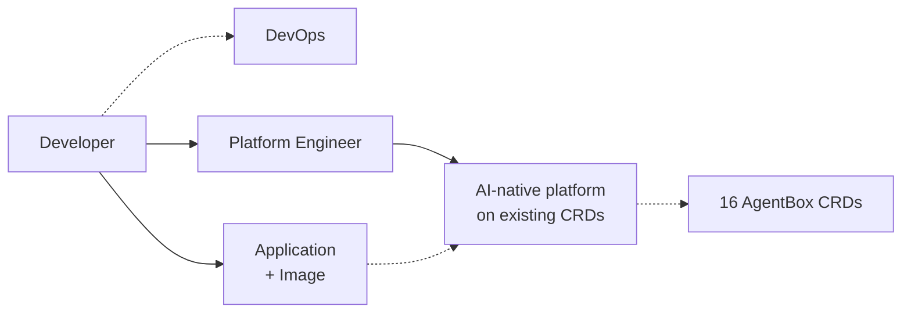
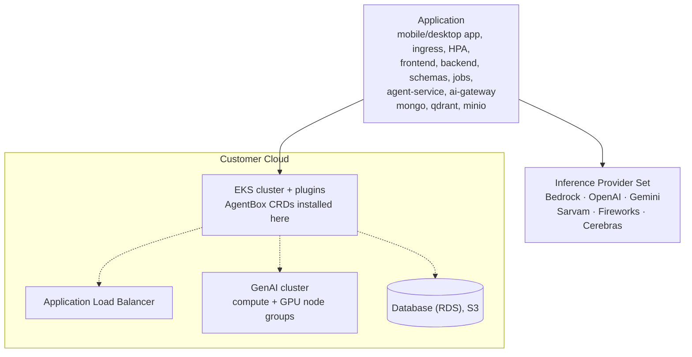

# Architecture

How AgentBox sits inside a cluster, and who touches what.

## Two audiences, one cluster

The split matters more than the boxes.

**Developers** own the agent. They build an image and they own what happens inside it —
the framework, the prompt, the control flow, the tool implementations. They ask the
platform for capability, not for permission to think.

**Platform engineers** own the fleet. They decide which models exist, which providers are
reachable, who gets an identity, what the guardrails are, what the budget is, and how any
of it scales. They express that as AgentBox objects in a repository, and it is reviewed
like any other infrastructure change.

**DevOps and the existing platform** stay in place. AgentBox objects are Kubernetes
objects, so GitOps, admission policy, RBAC, quota, cost allocation and audit logging all
apply without a parallel system.

The red path in my original sketch — application image feeding the platform, platform
feeding the CRD set — is the important one. The image is not described by the CRDs; it is
*run* by them.

## Where it runs

Everything above lives in the customer's own account. That constraint is not incidental —
it is why the primitives have to be Kubernetes-native rather than a hosted control plane.
A platform team cannot operate what they cannot see, and a regulator will not accept a
black box.

### How the pieces map to CRDs

| In the cluster | AgentBox object |
|---|---|
| Agent service (the developer's image) | `HarnessRuntime` |
| Tool endpoints the agents call | `ToolServer` |
| ai-gateway routing to Bedrock/OpenAI/Gemini/Sarvam/… | `Gateway` |
| Self-hosted models on the GPU node groups | `Model` + `ModelAutoScaler` |
| Fleet size under load | `HarnessSwarmAutoScaler`, `ToolServerAutoScaler` |
| Workload identity for agents | `AgentIdP` |
| Mongo, Qdrant, MinIO, S3, Kafka as agent data | `Dataset` |
| Traces and logs out of the agents | `Tracer` |
| Latency, tokens, queue depth, judged quality | `AIMetric` |
| Token spend per tenant, budgets | `AIMeter` |
| Policy enforced on agent behaviour | `Guardrail` |
| Fine-tuning and scheduled evaluation runs | `TrainLoop`, `Evaluator`, `Recipe` |
| Node groups, ingress, alert routing, secrets | **not AgentBox** — Karpenter, Ingress, Alertmanager, Secret |

That last row is deliberate. The moment a platform invents its own node pool object, it
has forked cluster capacity management and someone will pay for that at 3am.

## How a request flows

1. Traffic reaches the ALB and lands on the Service in front of a `HarnessRuntime`.
2. The agent image does its work. It calls tools by service discovery — `ToolServer`
   objects created a Service, and that Service is how it is reached.
3. Model calls go through the ai-gateway that a `Gateway` object configures. Whether that
   resolves to a self-hosted model on the GPU node group or to Bedrock is a platform
   decision, invisible to the agent.
4. Traces and metrics leave through the `Tracer` configuration; `AIMetric` turns them into
   numbers; `AIMeter` turns those into attributed, priced usage.
5. `Guardrail` objects watch those metrics and act — throttle, block, route elsewhere.
6. Autoscalers watch the same metrics and change replica counts.

Steps 4 through 6 are the loop that makes the stack operable. Without them you have a
deployment; with them you have a platform.

## Storage model

Every AgentBox object is stored twice over, depending on how you use it:

- **As a CRD** — `kubectl apply -k crds/` installs the CustomResourceDefinitions, and the
  API server stores and validates the objects natively.
- **As ConfigMaps and Secrets** — the Python layer in `k8s_modules/` persists specs into
  the `agentbox-system` namespace, splitting secret-looking fields into Secrets. This
  works on clusters where you cannot install CRDs, which in practice is many of the
  regulated environments I deal with.

Both paths use the same schemas, so a spec that validates in one validates in the other.
See [python-api.md](python-api.md).

## What is not here yet

There is no controller. Nothing watches these objects and reconciles them continuously —
today the Python managers create workloads when you call them, and the autoscaler kinds
describe a contract that nothing implements. That is the next thing to build, and the CRDs
are shaped the way they are so that a controller can be written against them without
changing the API.
